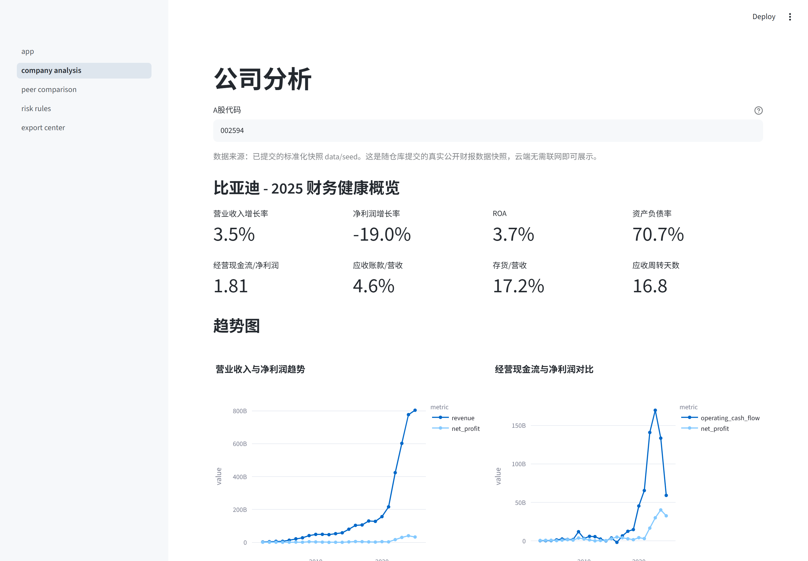
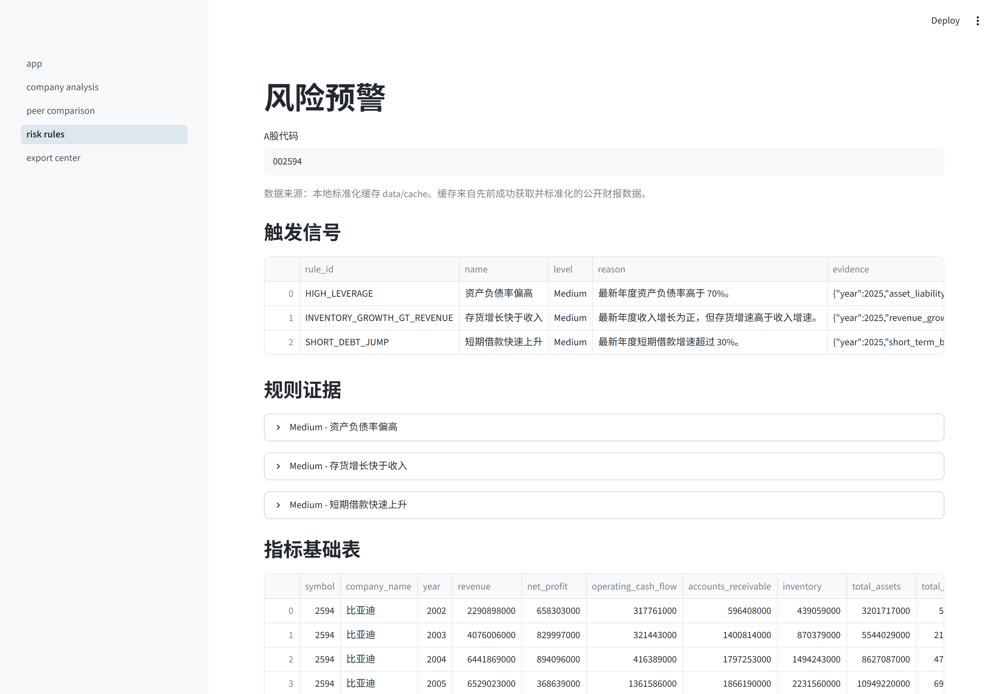
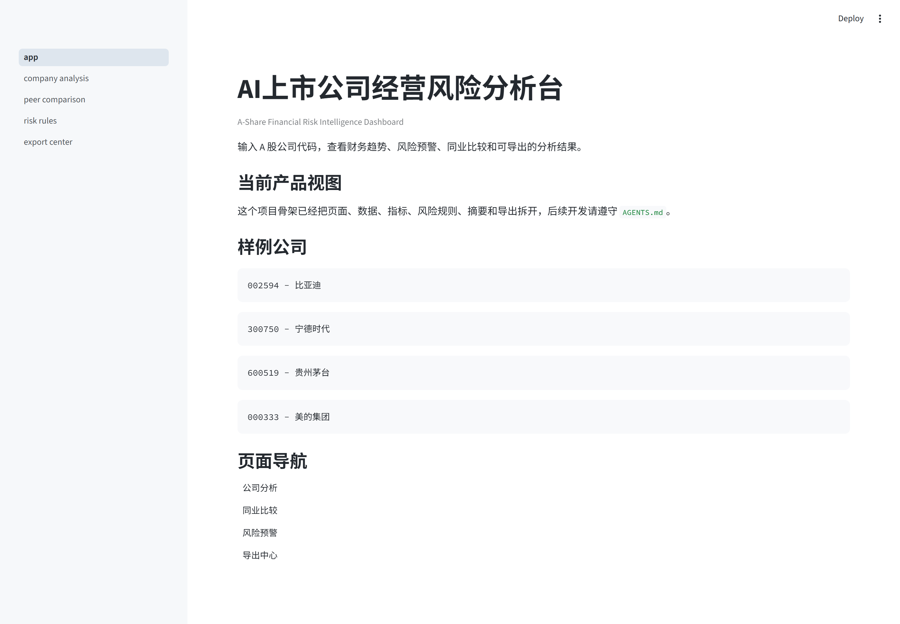
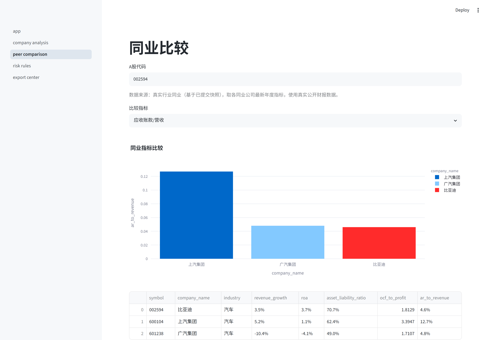
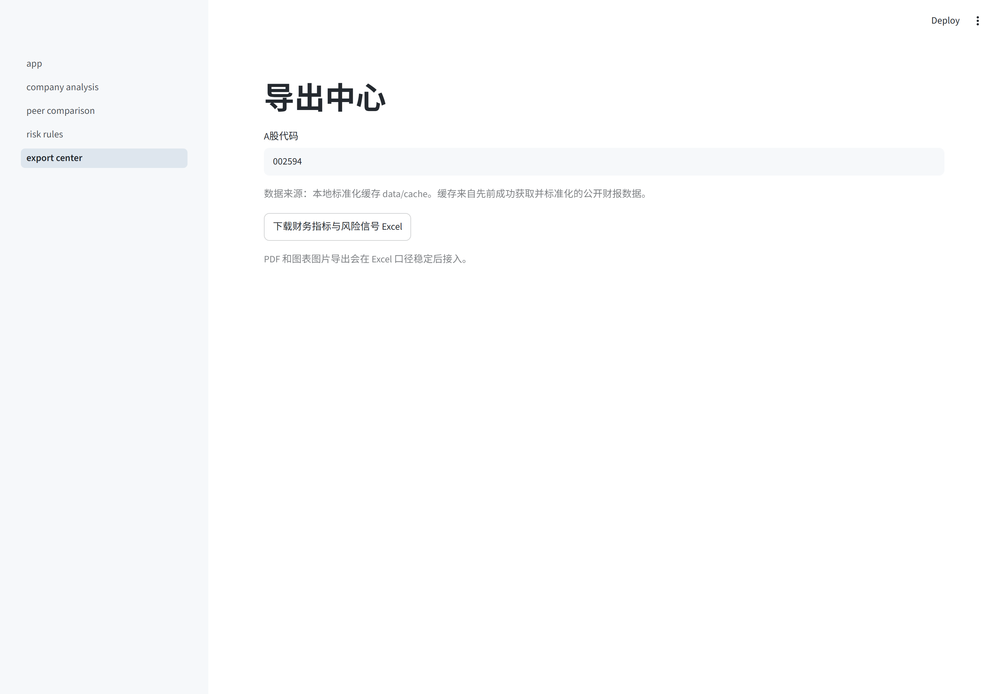

# A-Share Financial Risk Intelligence Dashboard

中文名：AI上市公司经营风险分析台

**🔗 在线体验 (Live Demo)：https://a-share-risk-dashboard-hmft7s3jyqsew6doqizjpp.streamlit.app/**

> 部署在 Streamlit Community Cloud，无需安装即可打开。建议先试已验证公司 `600519` / `002594` / `300750`。线上首跑无本地缓存时走 live AKShare，若上游慢/失败会退回带标注的样例数据而不崩溃。

这是一个面向求职作品集的公开可演示项目。用户输入 A 股公司代码后，系统生成财务趋势、同业比较、透明风险预警和一页式摘要，帮助招聘方快速看到作者的金融分析、数据处理、风险识别和 AI 产品化能力。

## 界面预览 (Screenshots)

下面是本地运行（默认公司 `002594` 比亚迪，数据来自本地标准化缓存）的真实界面，招聘方在打开应用前即可了解产品形态。

**公司分析页**：核心财务指标卡 + 营收/净利润与现金流趋势图，并标注数据来源。



**风险预警页**：透明规则触发信号、规则证据和指标基础表。



<details>
<summary>更多页面截图（首页 / 同业比较 / 导出中心）</summary>

**首页**：项目定位、样例公司和页面导航。



**同业比较页**：同业指标横向比较；当前为本地演示同业数据，真实同业口径将在数据层统一接入。



**导出中心**：下载财务指标与风险信号 Excel。



</details>

> 截图为本地真实渲染。线上 Streamlit Cloud 首跑无本地缓存时会改走 live AKShare 或带标注的样例数据，详见下文 Deployment 与 `docs/DEPLOYMENT.md`。

## Why This Project

很多数据分析求职项目停留在图表展示或模板预测。本项目强调三个更接近真实业务的点：

- 一眼看懂：上市公司经营风险分析。
- 能交互：输入公司代码，切换页面，查看风险证据，下载 Excel。
- 可解释：风险规则透明，结论绑定具体财务指标。

## Current Features

- 公司查询页：核心财务指标、趋势图、规则摘要。
- 同业比较页：应收账款占比、ROA、杠杆、现金流质量等横向比较。
- 风险预警页：透明规则、风险等级、触发证据和业务解释。
- 导出中心：导出财务指标和风险信号 Excel。
- 数据来源提示：页面明确标注 live AKShare、标准化缓存或样例 fallback。
- AI 协作规则：`AGENTS.md`、页面登记簿、任务日志和目录边界。

当前版本会优先尝试通过 AKShare 拉取公开财报数据，并在上游失败时退回到明确标注的样例数据。所有数据源逻辑集中在 `src/data/akshare_client.py`。

## Project Structure

```text
app.py                 # Streamlit 首页
pages/                 # Streamlit 多页面入口
src/data/              # AKShare 数据接入、缓存、字段标准化
src/metrics/           # 财务指标计算
src/risk/              # 透明风险规则
src/ai/                # 规则摘要和可选 LLM 提示词
src/export/            # Excel/PDF/图片导出
src/ui/                # 图表和 UI 组件
docs/                  # 项目规范、页面登记、任务日志
tests/                 # 基础测试
scripts/               # 可重复的项目维护和数据覆盖验证脚本
```

更多目录规则见 `AGENTS.md` 和 `docs/PROJECT_STRUCTURE.md`。

## Quick Start

```bash
python -m venv .venv
.venv\Scripts\activate
pip install -r requirements.txt
streamlit run app.py
```

Run checks:

```bash
python -m compileall app.py pages src tests
pytest
```

## Data Source Plan

目标数据源为 AKShare 公开接口。第一阶段接入年报口径：

- 利润表：营业收入、净利润、毛利。
- 资产负债表：总资产、总负债、应收账款、存货、短期借款。
- 现金流量表：经营活动现金流量净额。
- 财务指标：ROA、资产负债率等可作为校验或补充。

当前数据源 fallback 顺序：

1. 本地标准化缓存：`data/cache/normalized_financials_<symbol>.csv`
2. AKShare 东财年度三大表
3. AKShare 新浪三大表
4. 明确标注的本地样例数据

禁止公开 Wind、CSMAR、Choice 等付费数据库原始数据。

## Verified Public Data Coverage

Last checked: 2026-06-25, using AKShare 1.18.64. The source APIs are documented in AKShare's official stock data reference for Sina financial reports and Eastmoney yearly statements: https://akshare.akfamily.xyz/data/stock/stock.html

Re-run:

```bash
python -m scripts.verify_company_coverage 600519 002594 300750
```

| Symbol | Company | Initial verified source | Rows | Years | Missing core fields | Risk signals |
|---|---|---|---:|---|---|---:|
| `600519` | 贵州茅台 | `cache:normalized` | 28 | 1998-2025 | none | 0 |
| `002594` | 比亚迪 | `akshare:sina` | 24 | 2002-2025 | none | 3 |
| `300750` | 宁德时代 | `akshare:eastmoney:yearly` | 12 | 2014-2025 | none | 3 |

Notes:

- Successful live pulls write normalized CSV files under `data/cache/`, which is ignored by Git. Later local runs may show `cache:normalized` for these symbols.
- In the initial three-symbol smoke test, `002594` fell through to Sina. A direct retry of the Eastmoney yearly adapter returned complete rows, so this is recorded as upstream latency/transience rather than a field-mapping gap.
- Live AKShare calls depend on upstream public websites and may be slow or temporarily unavailable. The app keeps labeled cache and sample fallback so the demo remains clickable.

## Risk Rules

第一版不做黑箱机器学习评分，而是采用透明规则：

- 应收账款增速连续高于收入增速。
- 经营现金流连续低于净利润。
- 资产负债率偏高。
- 毛利率明显下降。
- 存货增长快于收入。
- 短期借款快速上升。
- 收入增长但回款效率下降。

完整说明见 `docs/RISK_RULES_SPEC.md`。

## Deployment (Streamlit Community Cloud)

**已部署，在线地址：https://a-share-risk-dashboard-hmft7s3jyqsew6doqizjpp.streamlit.app/**

本项目已部署到 [Streamlit Community Cloud](https://streamlit.io/cloud)，招聘方点开上面的公开 URL 就能体验，无需本地装环境。完整逐项检查清单见 `docs/DEPLOYMENT.md`。

关键事实：

- **入口文件**：`app.py`（云端 "Main file path" 填这个）。
- **依赖**：根目录 `requirements.txt`，已固定最小可运行依赖，含 `akshare` 等。`pytest` 仅本地测试用，云端运行 app 不依赖它。
- **Python 版本**：`pyproject.toml` 要求 `>=3.10`；在 Cloud 的 Advanced settings 里选 Python 3.10/3.11。
- **配置与机密**：`.streamlit/config.toml`（主题、`headless=true`）随仓库提交；`.streamlit/secrets.toml` 不提交（已在 `.gitignore` 排除），当前 MVP 无需任何密钥。
- **缓存不进 Git**：`data/cache/*` 被 `.gitignore` 排除，所以云端是干净环境，没有本地标准化缓存。
- **数据 fallback 兜底**：云端首跑因为没有缓存，会按 `live AKShare 东财 → live AKShare 新浪 → 标注的样例数据` 顺序取数。AKShare 依赖上游公开站点，可能比本地慢或偶发失败；此时页面退回带标注的 sample 数据而不是崩溃，demo 始终可点。

部署后冒烟检查：四个页面均可打开，`600519` 等已验证公司能出图，数据来源提示与实际 live/sample 来源一致，导出中心能下载 Excel。

## AI Collaboration

后续任何 AI 修改本项目时，必须先读：

- `AGENTS.md`
- `docs/PROJECT_STRUCTURE.md`
- `docs/PAGE_REGISTRY.md`
- `docs/TASK_LOG.md`

新增或修改页面后，必须更新 `docs/PAGE_REGISTRY.md`。每次 AI 完成任务后，必须更新 `docs/TASK_LOG.md`。

## Roadmap

- 接入 AKShare 真实财报字段映射。
- 增加行业分类和真实同业筛选。
- 增强 Excel 样式和一页式报告。
- 增加 PDF 导出。
- 接入可选 LLM 润色，但保留规则摘要 fallback。
- 部署到 Streamlit Community Cloud。
